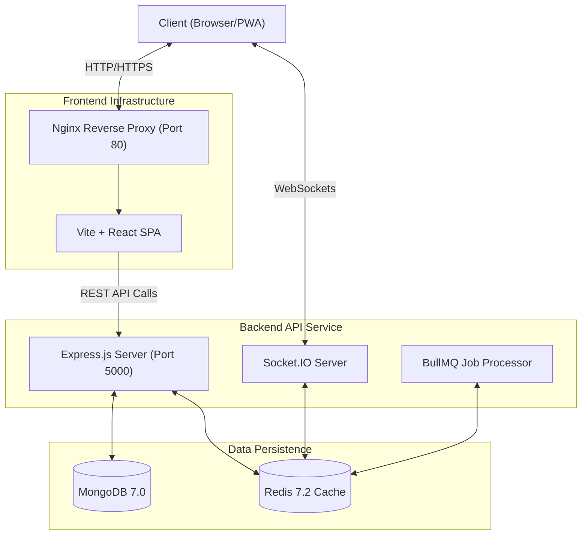
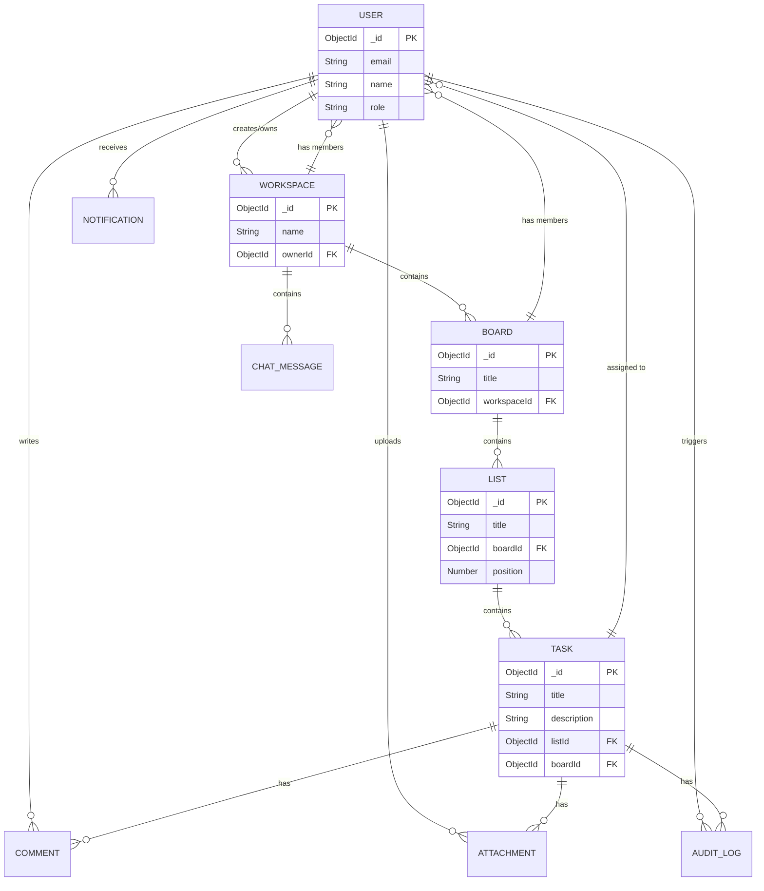

# Mini SaaS Platform

An enterprise-grade collaboration platform engineered with modern architectural patterns.

## 🚀 Architecture Diagram



## 🗄️ Entity-Relationship (ER) Diagram



## 🛠️ Quick Start

The entire stack is containerized. To spin up the production-ready infrastructure:

1. Clone the repository.
2. Ensure you have Docker and Docker Compose installed.
3. Run the following command:

```bash
docker-compose up --build -d
```

4. The frontend will be available at `http://localhost:3000`.
5. The API docs (Swagger) will be available at `http://localhost:5000/api/docs`.

## 🧪 Testing

The repository relies on `jest` for exhaustive test suites.
You can run the CI test matrix locally:

```bash
# Run backend tests
npm run test --workspace=backend

# Run frontend tests
npm run test --workspace=frontend
```
